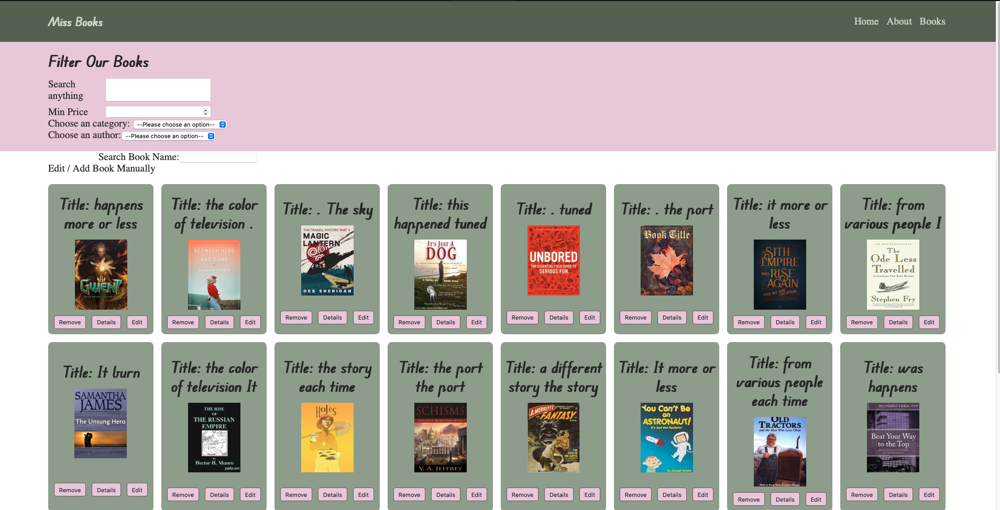

# Miss Books 📚

A modern React-based book management application that allows users to browse, manage, and review books. Built as part of a Full Stack Development course, this project demonstrates proficiency in React, component-based architecture, and local storage management.



## 🚀 Features

- **Book Management**: Add, edit, delete, and view books
- **Google Books Integration**: Search and add books from Google Books API
- **Review System**: Add and view reviews for books
- **Filter & Search**: Filter books by title, category, and author
- **Responsive Design**: Mobile-friendly interface
- **Local Storage**: Persistent data storage in browser
- **Router Navigation**: Seamless page navigation with React Router

## 🛠️ Technologies Used

- **Frontend**: React 18 (with CDN)
- **Routing**: React Router DOM
- **Styling**: CSS3 with modular component styling
- **Build Tools**: Babel for JSX transformation
- **HTTP Client**: Axios for API requests
- **Storage**: Local Storage for data persistence

## 📂 Project Structure

```
miss-books/
├── app.js                 # Application entry point
├── index.html            # Main HTML file
├── RootCmp.jsx           # Root component with routing
├── assets/
│   ├── img/              # Book cover images
│   └── style/            # CSS stylesheets
├── components/           # Reusable React components
│   ├── AppHeader.jsx
│   ├── BookFilter.jsx
│   ├── BookList.jsx
│   ├── BookPreview.jsx
│   └── ...
├── pages/                # Page components
│   ├── Home.jsx
│   ├── BookIndex.jsx
│   ├── BookDetails.jsx
│   ├── BookEdit.jsx
│   └── About.jsx
└── services/             # Business logic and utilities
    ├── book.service.js
    ├── async-storage.service.js
    └── util.service.js
```

## 🏁 Getting Started

### Prerequisites

- Modern web browser (Chrome, Firefox, Safari, Edge)
- Local web server (optional but recommended)

### Installation

1. **Clone the repository**
   ```bash
   git clone https://github.com/LiorLazar/miss-books.git
   cd miss-books
   ```

2. **Serve the application**
   
   **Option A: Using Python (if installed)**
   ```bash
   python -m http.server 8000
   ```
   
   **Option B: Using Node.js live-server**
   ```bash
   npm install -g live-server
   live-server
   ```
   
   **Option C: Using VS Code Live Server extension**
   - Install the Live Server extension
   - Right-click on `index.html` and select "Open with Live Server"

3. **Open your browser**
   - Navigate to `http://localhost:8000` (or the port shown in terminal)

## 📱 Usage

### Navigation
- **Home**: Welcome page with project overview
- **Books**: Browse all books with filtering options
- **About**: Learn about the project (includes Team and Vision sections)

### Book Management
- **Add Books**: Use the "Add Book" button to create new books or search Google Books
- **Edit Books**: Click the edit icon on any book to modify its details
- **Delete Books**: Use the delete option to remove books
- **View Details**: Click on a book to see full details and reviews

### Reviews
- Add reviews with ratings to any book
- View all reviews on the book details page

## 🎨 Features in Detail

### Filtering System
- **Text Search**: Filter books by title
- **Category Filter**: Browse books by genre
- **Author Filter**: Find books by specific authors
- **Price Range**: Filter by minimum and maximum price

### Google Books Integration
- Search for books using Google Books API
- Add books directly from search results
- Automatic image and metadata import

### Responsive Design
- Mobile-first approach
- Adaptive layouts for different screen sizes
- Touch-friendly interface

## 🔧 Development

### Component Architecture
The project follows React best practices with:
- Functional components with hooks
- Component composition
- Props drilling for state management
- Modular CSS with component-specific stylesheets

### Service Layer
- **book.service.js**: Core book operations (CRUD)
- **async-storage.service.js**: Local storage abstraction
- **util.service.js**: Utility functions and helpers
- **event-bus.service.js**: Component communication

## 📚 Learning Objectives

This project demonstrates:
- React component lifecycle and hooks
- State management without external libraries
- React Router for SPA navigation
- API integration and error handling
- Local storage for data persistence
- CSS Grid and Flexbox for layouts
- Responsive web design principles

## 🤝 Contributing

This is a learning project, but suggestions and improvements are welcome!

1. Fork the project
2. Create a feature branch (`git checkout -b feature/AmazingFeature`)
3. Commit your changes (`git commit -m 'Add some AmazingFeature'`)
4. Push to the branch (`git push origin feature/AmazingFeature`)
5. Open a Pull Request

## 📄 License

This project is created for educational purposes as part of a Full Stack Development course.

## 👤 Author

**Lior Lazar**
- GitHub: [@LiorLazar](https://github.com/LiorLazar)

## 🙏 Acknowledgments

- Full Stack Development Course instructors
- React documentation and community
- Google Books API for book data

---

*Built with ❤️ using React*